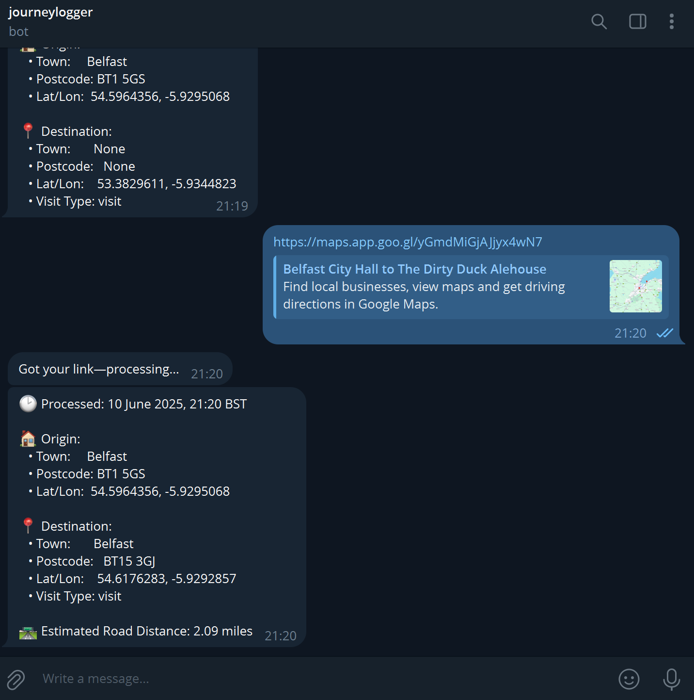
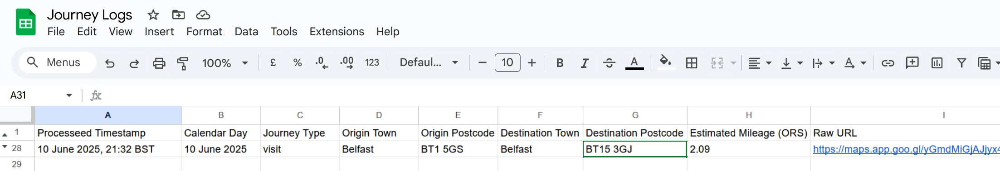

# Journey Logger

**Journey Logger** is a tool for tracking and logging journeys. It collects data, enriches it with location/time metadata, logging to a google sheet.

Simply share directions from google maps link to a telegram bot.





---

## 🔧 Prerequisites

1. **Python 3.11+**  
2. Create accounts / API keys:  
   - **GPS provider** (e.g. Google Maps, Mapbox)  
   - **HTTP endpoint** where logs will be sent
3. Use [/botfather](https://telegram.me/BotFather) to create Telegram bot
4. Clone this repo:
   ```bash
   git clone https://github.com/amiller411/journey-logger.git
   cd journey-logger
5. Get sheet id from Google Sheet with headings: 
``` bash
Processeed Timestamp,	
Calendar Day,
Journey Type,
Origin Town,
Origin Postcode,
Destination Town,
Destination Postcode,
Estimated Mileage (ORS),
Raw URL,
Notes 
``` 
6. Create `src\journeylogger\secrets\addresses.json` as below if there are known known locations to use:
``` bash
{
  "home": ["123 drury lane", "muffin man"],
  "depot": [
    "generic business park",
    "bt99 xdx"
  ]
}
```
7. setup .env files as follows:
``` bash
ORS_API_KEY=
TELEGRAM_BOT_TOKEN=
GOOGLE_SHEET_ID=
GOOGLE_SERVICE_ACCOUNT_JSON=
NOMINATUM_AGENT=
```

To run locally, once installed:
python -m journeylogger